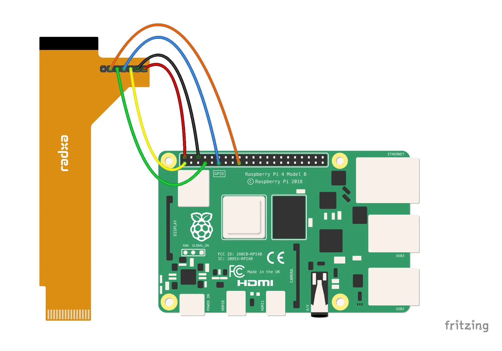

# Using Radxa Displays on Raspberry Pi

## Radxa Display 8 HD

Radxa 8-inch 800*1280 TFT display, supports capacitive touch.

Product Link: [https://radxa.com/products/accessories/display-8hd](https://radxa.com/products/accessories/display-8hd)

### Hardware connection

#### Working with Raspberry Pi 4B

Use No. 2 15-pin to 40-pin FPC cable.


The FPC cable has an additional 7-pin holder that needs to be connected as defined below:


Connect the screen to the Raspberry Pi 4B as follows:

| Radxa Display 8 HD |  Raspberry Pi 4B  |
|:-------------------|:------------------|
| VCC-5V             | PIN 2:  5V Power  |
| GND                | PIN 6:  GND       |
| BL-PWM             | PIN 1:  3V3 Power |
| TP-RST             | PIN 11: GPIO 17   |
| TP-INT             | PIN 7:  GPIO 4    |
| LCD-RESET          | PIN 17: 3V3 Power |

*The seventh pin is currently unused*



### Software Settings

1. Raspberry Pi OS used

   https://www.raspberrypi.com/software/operating-systems/

   - Raspberry Pi OS (64-bit)
   - Release date: March 15th 2024
   - File name: 2024-03-15-raspios-bookworm-arm64.img.xz

2. Install required packages

   ```
   sudo apt update
   sudo apt install dkms raspberrypi-kernel-headers
   ```

3. Install kernel driver

   Download the driver installation package [here](https://github.com/radxa/radxa-displays-on-raspberry-pi/blob/main/panel-radxa-dsi-dkms_1.0.0_all.deb), or use the wget command to download it:
   ```
   wget https://github.com/radxa/radxa-displays-on-raspberry-pi/blob/main/panel-radxa-dsi-dkms_1.0.0_all.deb
   ```

   Install the driver:
   ```
   sudo dpkg -i panel-radxa-dsi-dkms_1.0.0_all.deb
   ```

4. Modify configuration

   The configuration file `config.txt` can be found at the root directory of the microSD card. Alternatively, you can access it by using the command `vi`:

   ```
   sudo vi /boot/firmware/config.txt
   ```

   Add the following three lines of configuration after [all]:

   ```
   [all]
   display_auto_detect=0
   dtoverlay=vc4-kms-v3d
   dtoverlay=vc4-kms-dsi-radxa-panel
   ```

   After saving, restart:
   ```
   sync
   sudo reboot
   ```

   After restarting, the screen should display normally.

   

5. Configured as landscape orientation

   - Screen

     Boot to desktop. Run screen configuration utility from preferences menu and choose the correct orientation of display. Click the green tick button and display should be rotated.

   - Touch Panel

     Work in progress...

### Known Issues

- The backlight brightness of the current version is not adjustable, and this problem will be fixed in the next version.
